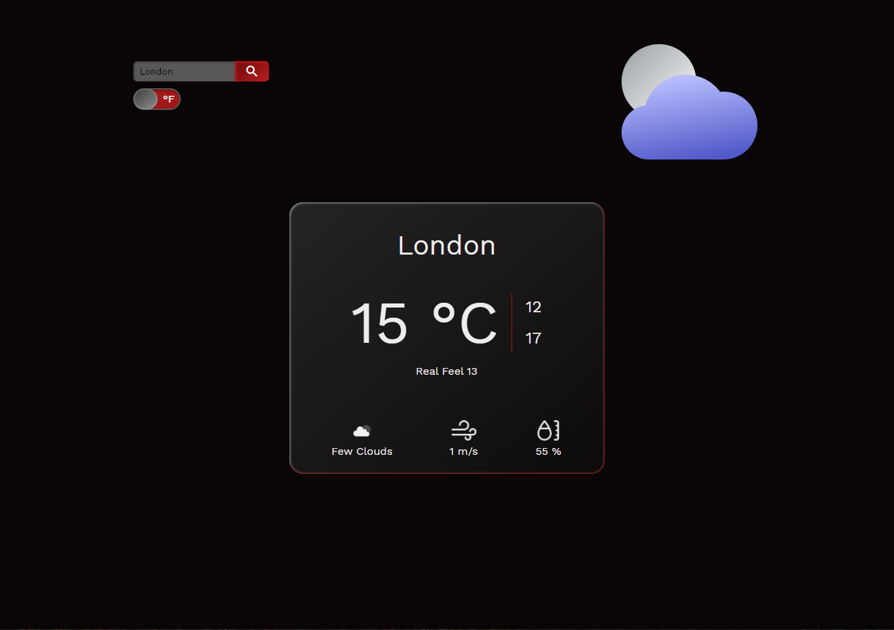
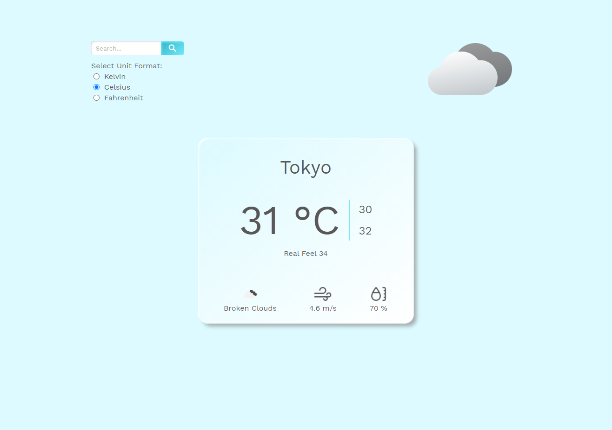
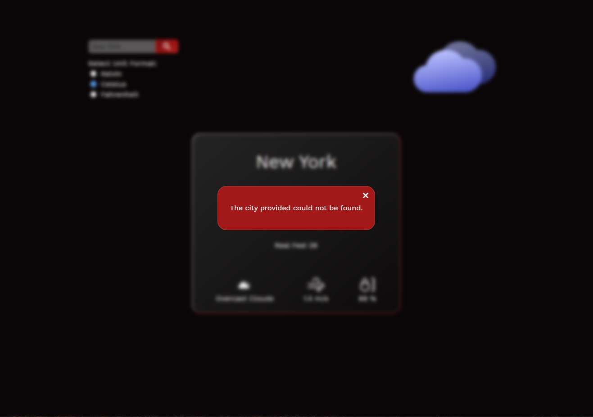

# Weather-App
> In this project, I built a weather forecast site using the OpenWeatherMap API.  
Here I applied DOM manipulation by dynamically rendering the website using JavaScript, Modules, and Webpack.

## Screenshot

## Live Demo

You can try it [here](https://rossielcs-weather-app.netlify.app/).

## :hammer:  Built With

- HTML5,
- CSS3,
- SASS,
- Stylelint,
- Eslint,
- JavaScript,
- NPM,
- Webpack,
- Visual Studio Code

## :computer: Getting Started

To get a local copy up and running follow these simple example steps.

### Prerequisites
Before you continue, be sure that you have installed:

- A Git GUI.
- An Integrated Development Environment.
- [Npm](https://docs.npmjs.com/downloading-and-installing-node-js-and-npm).

### Usage
To run the project:

- Clone the repository with Git.
- Open it with your IDE.
- Install the dependencies.  
`npm install`
- Run the website.   
`npm run start`

## :gem:  Features
- It displays the temperature in two different formats.
- The style colors change depending on if it is day or night.
- It shows a message if the user tries to make a search with the input field empty or if it could not find the city.

## :woman:  Author

**Rossiel Carranza**

- Github: [@RossielCS](https://github.com/RossielCS)
- Linkedin: [Rossiel Carranza](https://www.linkedin.com/in/rossiel-carranza/)

## 🤝 Contributing

Contributions, issues, and feature requests are welcome!

Feel free to check the [issues page](issues/).

1. Fork this repository.
2. Create a branch: git checkout -b <branch_name>
3. Make your changes and commit them: git commit -m '<commit_message>'
4. Push to the original branch: git push origin <project_name>/<location>
5. Create the pull request.

## Show your support

Give an ⭐️ if you like this project!

## 📝  License

This project is [MIT](lic.url) licensed.
